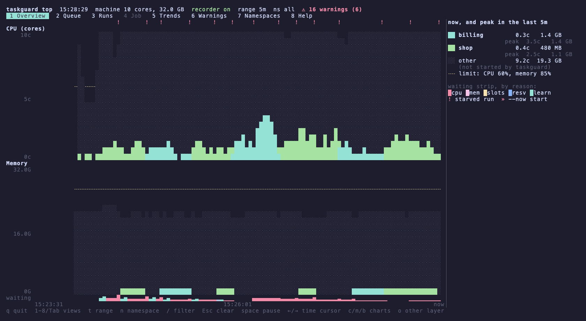
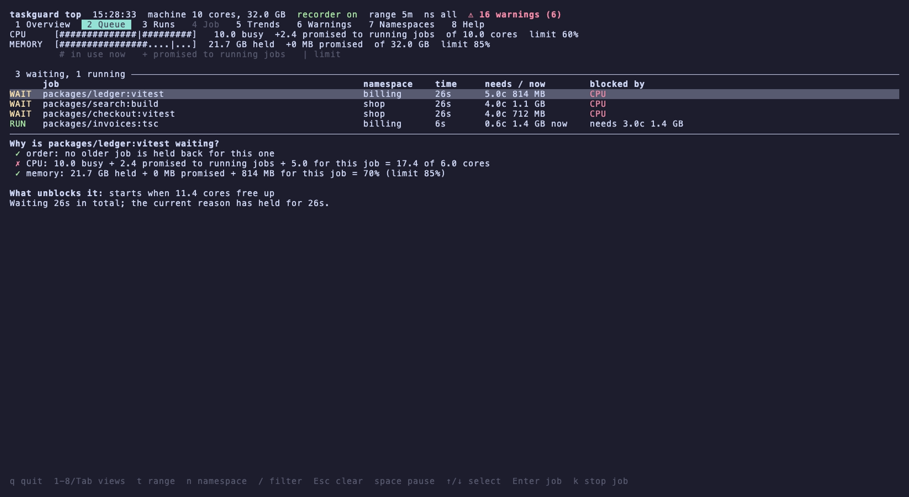
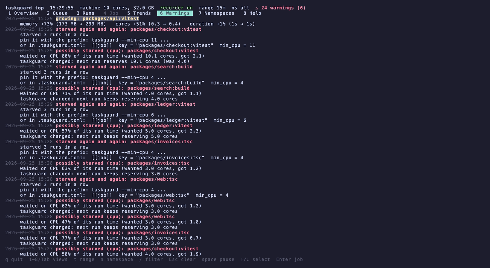
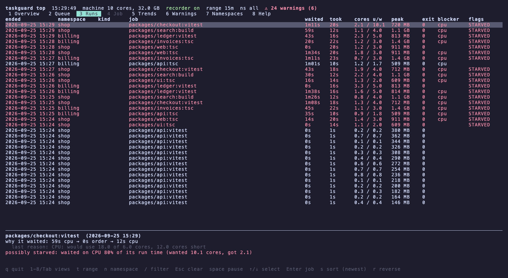
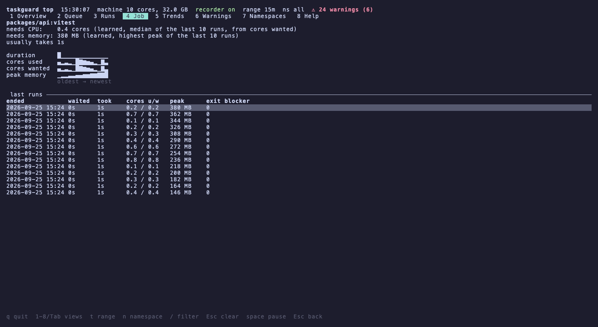
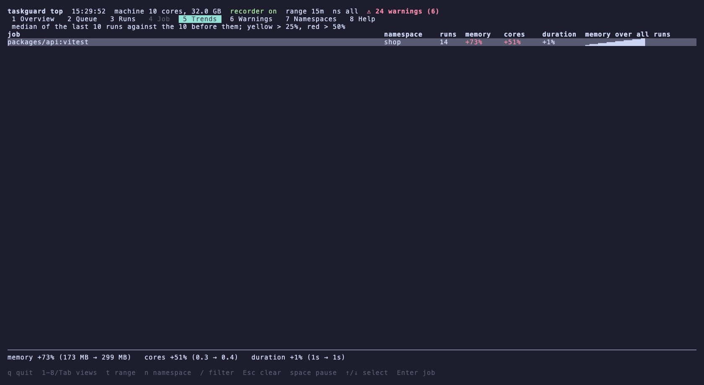
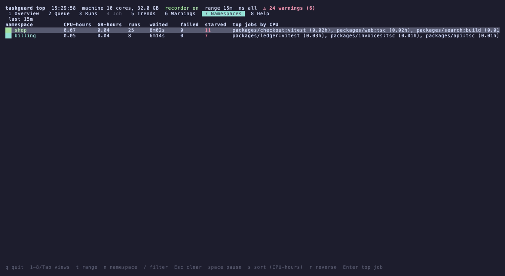
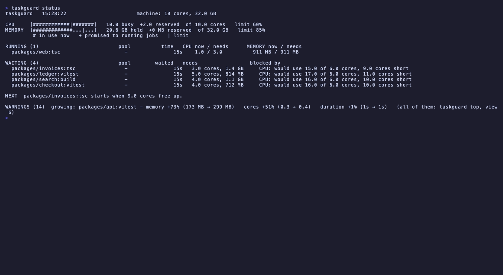

# taskguard

A `sem` that learns what each job needs.

Put `taskguard` in front of a command. The command starts only when the
machine has room for the CPU and memory that the same command used on its past
runs. Every call on the machine shares one queue, from any terminal, worktree,
task runner or agent.



The dashboard above shows a demo: two repos, `shop` and `billing`, share one
laptop. Coloured areas are the jobs that taskguard started, one colour per
repo. The grey area is everything else on the machine. The strip at the bottom
shows how many jobs waited, and why. To see it yourself, run
[the demo](#try-it-with-the-demo).

macOS and Linux. One binary, written in Rust.

## The problem

A task runner caps tasks inside one run only. Two terminals, two worktrees, an
editor and a coding agent can each start a full set of compiles and test
suites. Nothing on the machine holds a shared ceiling, so a large monorepo
pushes the machine into swap, and the operating system starts to kill
processes.

A fixed limit does not fix this. `turbo --concurrency=2` still lets two jobs
that each want 20 GB run side by side, and it holds back twenty small jobs that
would fit easily. GNU `sem` has the same gap: it counts slots, and a 25 GB
compile and a 50 MB lint each take one slot.

`taskguard` counts what the jobs really use.

## How it decides

A job starts when both of these fit:

```
CPU busy     + CPU still promised to running jobs     + this job's CPU need     <= cpu_max  (100% of cores)
memory held  + memory still promised to running jobs  + this job's memory need  <= mem_max  (85% of RAM)
```

- **Needs are learned.** Each run is measured, and the result is kept per
  command. The memory need is the highest peak of the last 10 runs, because
  running out of memory kills processes. The CPU need is the median of the
  cores the job *wanted* in its last 10 runs, because too little CPU only
  makes a job slower.
- **A first run reserves an estimate.** A job with no history counts as
  needing what similar jobs needed: the 75th percentile peak of jobs with the
  same label (typecheck, test, ...), or 1.5 GB without any (`new_job_mem`). New
  jobs start in batches sized by the free room, and a batch starts only after
  the one before has run for 5 seconds (`learn_stagger`), so the readings can
  show what the new jobs really take.
- **Memory pressure stops everything new.** When the kernel reports memory
  pressure (macOS: warning or critical; Linux: PSI above 20%), nothing new
  starts until it eases, whatever the estimates say.
- **Memory is read at its recent peak.** Admission uses the highest reading
  of the last 10 seconds, so a job never starts in a short dip.
- **Short jobs skip the CPU check.** A job that usually ends within 5 seconds
  is over before the CPU reading could react to it, so holding it back only
  makes it late. Memory is checked for every job.
- **"Promised" is the growth still to come.** A compile that sits at 2 GB
  but peaked at 20 GB last time still has 18 GB to take. Without this, a second
  job is started into space the first one is about to use.
- **The machine readings count everything.** Your browser and your editor
  count too, not only jobs that taskguard started.
- **Nothing running means the job starts,** whatever the CPU and memory
  readings say, so the queue cannot deadlock on a wrong reading. Memory
  pressure is the one exception: then the load comes from other programs, and
  jobs wait until it eases.
- **Any order, oldest first.** A small job may pass a big one that does not
  fit yet. This is safe: a job only reaches taskguard when its launcher has
  decided that it may run. Turbo starts a task only after the tasks it depends
  on are done, and `a && b` starts `b` only after `a` ends.
- **No starvation.** A job that newer jobs have passed for 2 minutes gets a
  reservation. Nothing newer starts until it has started.
- **Pools** add a slot ceiling where jobs share something: one database, one
  set of services, one lock file. `taskguard --id e2e -j1 ...`. CPU and memory
  are always shared by the whole machine.

### What is measured

| | macOS | Linux |
| --- | --- | --- |
| Job memory | physical footprint of the whole process tree | PSS of the whole process tree |
| Job CPU used | user + system time | `schedstat` run time |
| Job CPU wanted | used + time spent ready but waiting for a core (`ri_runnable_time`) | used + run-queue wait (`schedstat`) |
| Machine CPU | host tick counters | `/proc/stat` |
| Machine memory | the higher of active + wired + compressed, and the kernel's `memorystatus_level` | total - available |
| Memory pressure | `memorystatus_vm_pressure_level` | `/proc/pressure/memory` |

On macOS, active + wired + compressed falls exactly when the machine is in
trouble: under pressure the kernel moves pages to the inactive list and writes
compressed pages to swap. The kernel's own figure rises instead, so taskguard
takes the higher of the two.

Physical footprint is used on macOS because resident size hides compressed
pages. One measured `tsc` reported 3.8 GB resident while it really held 22 GB.
All readings are syscalls. They cost microseconds, not the 120 ms per process
of `/usr/bin/footprint`.

The whole process tree is measured, because the memory often lives in a
grandchild: a JavaScript entry point is a node process that starts the native
compiler.

## Install

Prebuilt binaries for macOS (Apple silicon, Intel) and Linux (x86_64, ARM,
static) are on the [releases page](https://github.com/SpoBo/taskguard/releases):

```sh
# pick the target for your machine: aarch64-apple-darwin, x86_64-apple-darwin,
# x86_64-unknown-linux-musl or aarch64-unknown-linux-musl
target=aarch64-apple-darwin
curl -fsSL "https://github.com/SpoBo/taskguard/releases/latest/download/taskguard-$target.tar.gz" | tar -xz
install -m 755 "taskguard-$target/taskguard" ~/.local/bin/taskguard
```

Or build it from source:

```sh
git clone https://github.com/SpoBo/taskguard.git
cd taskguard
cargo install --path .
```

This puts `taskguard` in `~/.cargo/bin`. It needs Rust 1.89 or newer.

## Use

Put the prefix in the package scripts:

```json
{
  "scripts": {
    "typecheck": "taskguard tsc -p .",
    "test": "taskguard bun --bun vitest run",
    "build": "taskguard vite build"
  }
}
```

With turbo, prefix the package scripts, not the root `turbo run` command, and
give turbo a high `--concurrency`. Turbo then only sets the upper limit, and
taskguard decides what runs. A prefixed `turbo run` would hold one slot for the
whole run.

### Syntax

The shape follows GNU `sem`. There is one difference: taskguard runs in the
foreground by default, because turbo and npm need the command's exit code.

```
taskguard [options] [--] COMMAND [ARGS...]
taskguard --wait [--id NAME]
```

| Option | What it does |
| --- | --- |
| `-j N`, `+N`, `-N`, `N%` | Slot ceiling for this pool, as in sem. None by default. |
| `--id NAME` | Pool name (sem's semaphore id). |
| `--ns NAME` | Namespace for the dashboard. The default is the repo name, the same for every worktree. |
| `--st SECS` | `SECS > 0`: run anyway after SECS. `SECS < 0`: give up after -SECS, exit 124. |
| `--st-exit N` | The exit code when `--st` gives up, instead of 124. |
| `--key KEY` | History key. The default is the project path plus the command. |
| `--min-cpu N` | Never start with fewer than N free cores. |
| `--min-mem SIZE` | Never start with less than SIZE free (`6G`, `512M`). |
| `--now` | Skip the queue, but still measure and learn. |
| `--bg` | Wait for room, then return and let the job run on. |
| `--pipe` | With `--bg`: pass stdin to the command. |
| `-q` | Print only waits longer than the status interval. |
| `--hints`, `--no-hints` | Agent hints on or off for this call. |

The `--` is optional. Options stop at the first word that is not an option.
Use `taskguard run ...` for a command that has the same name as a subcommand.

`TASKGUARD_DISABLE=1` skips taskguard for one command. A call nested inside a
running job starts at once and takes no second slot, even when a task runner in
between drops environment variables.

Long-running commands are never queued: watch modes, dev servers, `--version`
and `--help` run straight through. See `taskguard doctor --explain "COMMAND"`.

### What a waiting job prints

Status lines go to stderr, so the command's own output stays clean:

```
[taskguard] queued packages/api:tsc - learned: 3.7 cores, 2.5 GB (5 runs)
[taskguard] waiting 15s web:build - blocked by CPU: would use 9.8 of 8.0 cores, 1.8 cores short. It starts when packages/api:tsc finishes; this is not a hang
[taskguard] start web:build - waited 19s; fits: CPU 2.7+1.3+4.4 of 8.0 cores, memory 63% of 85%
[taskguard] done web:build - 7s, used 4.4 cores sustained (wanted 4.8), 1.2 GB peak, exit 0 (0 still queued)
```

**Agent hints** ("this is not a hang", "starts when X finishes") are on by
default, so an LLM agent does not kill a command that only waits. Set
`hints = false` per repository or directory. `--hints` and `--no-hints` override
it for one call.

### Starved runs

taskguard also measures whether a job was held back while it ran: its threads
waited for a core more than half as long as they ran, it paged memory in while the machine was under memory pressure, or it
took 1.5 times its usual time while the machine was full. A starved run
teaches a higher need for the next run, and with hints on it prints advice
that can be pasted:

```
[taskguard] warning packages/api:vitest_run - possibly starved: waited on CPU 64% of its run time (wanted 6.1 cores, got 2.2)
[taskguard] advice already done: the next run reserves 6.1 cores (was 3.0)
[taskguard] advice to pin it: script "test" in packages/api/package.json -> "taskguard --min-cpu 7 bun --bun vitest run"
[taskguard] advice or let vitest fit the room it gets: add --maxWorkers=2
```

The advice names the exact script and file, because package managers tell each
script its name and package.json path. It knows the parallelism flags of
vitest, jest, playwright and turbo, and the node heap flag.

## The dashboard

`taskguard top` is a terminal dashboard in the style of btop.

**Queue.** What runs and what waits. The Why panel checks every rule for
the selected job, with numbers, and says what will unblock it.



**Warnings.** Runs that were starved, what taskguard changed for the next
run, and the minimum to pin when a job starves again and again.



<details>
<summary>More views: runs, job, trends, namespaces, and the <code>status</code> command</summary>











</details>

| View | What it shows |
| --- | --- |
| 1 Overview | Machine CPU and memory over time. The load of jobs taskguard started is stacked in colour per namespace; the grey rest is load taskguard did not start. A strip shows how many jobs waited, coloured by reason, and `!` marks a starved run. |
| 2 Queue | What runs and what waits. The Why panel checks every rule for the selected job, with numbers, and says what will unblock it and when. |
| 3 Runs | Past runs, sortable and filterable, with the reasons each one waited. |
| 4 Job | One command: its learned needs and where each comes from, sparklines over its runs, and what taskguard changed on its own. |
| 5 Trends | Commands whose memory, CPU or duration grows: the last 10 runs against the 10 before. |
| 6 Warnings | Starved runs with the evidence, suggested minimums, trend alerts, and `--now` runs that went over a limit. |
| 7 Namespaces | CPU-hours, GB-hours, runs, waits and starved runs per namespace. |

Keys: `1`-`8` views, `t` time range (5m to 7d), `n` namespace, `/` filter,
`←`/`→` time cursor, `c`/`m`/`b` charts, `o` hide the other layer, `s`/`r`
sort, `Enter` open a job, `k` stop a job, `q` quit. The mouse selects rows and
scrolls the time range.

`taskguard top --print [--view NAME] [--range 1h]` prints one frame as plain
text, for scripts and agents.

The history comes from a small recorder process. The first job starts it, it
samples the machine every 2 seconds, and it exits by itself 30 minutes after
the last job. Nothing is installed as a service.

## Try it with the demo

`scripts/demo.sh` fills a scratch state with about four minutes of made-up
monorepo work, in two repos. The jobs are busy loops and a Python process that
holds memory, so taskguard really measures, learns and queues them. The demo
sets a low CPU limit (60%), so jobs have to wait.

```sh
scripts/demo.sh                                        # terminal 1
TASKGUARD_DIR=/tmp/taskguard-demo/state taskguard top  # terminal 2
```

The demo keeps its state in `/tmp/taskguard-demo`. Your real queue and
history are not touched, so a plain `taskguard top` does not show the demo
jobs. Set `TASKGUARD=/path/to/taskguard` to try a local build.

## Commands

| Command | What it does |
| --- | --- |
| `taskguard [options] COMMAND` | Run a command when the machine has room for it |
| `taskguard --wait [--id NAME]` | Wait until no job of the pool runs or waits |
| `taskguard top` | The dashboard |
| `taskguard status [--json]` | What runs, what waits, and why |
| `taskguard history` | Learned needs per command |
| `taskguard doctor` | Configuration, live readings, and leftover tsc-queue shims |
| `taskguard doctor --explain "COMMAND"` | How one command is matched, pooled and learned |
| `taskguard import-history` | Load tsc-queue's memory history |

## Configuration

Settings come from files, in layers. Later layers win:

1. built-in defaults
2. `~/.config/taskguard/config.toml`
3. `[dir."<path>"]` sections in that file, for jobs inside that path
4. `.taskguard.toml` in the repository
5. command-line flags

Files are used, not environment variables, because turbo's default strict env
mode drops variables it does not know.

[`taskguard.example.toml`](taskguard.example.toml) lists every setting. The
most used ones:

```toml
cpu_max = 100          # percent of all cores
mem_max = 85           # percent of RAM
hints = true           # agent hints on status lines

[pool.e2e]             # a slot ceiling for one kind of job
max_slots = 1

[[job]]                # settings for one command
match = "vitest run --project integration"
min_cpu = 4
min_mem = "6G"
```

The built-in defaults cover the DALP monorepo out of the box:

- single-slot pools per checkout for database migrations, contract compiles,
  e2e runs and integration runs
- launchers such as `bun --bun`, `bunx`, `npx`, `pnpm exec`, `devenv shell --`
  and `node` are stripped before matching
- watch modes and dev servers run straight through

## Known limits

- taskguard decides when a job starts. It never touches a job that runs. When
  another program suddenly takes a lot of memory after taskguard's jobs have
  started, the machine can still fill up; taskguard then starts nothing new
  until the pressure eases. A future version may pause (SIGSTOP) its newest
  running jobs under critical pressure and resume them when memory frees up.
- A job with no history reserves an estimate. A first run far bigger than
  similar jobs can still take more than its estimate before it is learned.

## Moving from tsc-queue

This repository used to be `SpoBo/tsc-queue`, a bash tool that replaced the
compiler inside `node_modules` with a shim. GitHub redirects the old URL. taskguard needs no shims.

```sh
tsc-queue unload         # stop its launchd jobs first, or they re-wrap the compilers
tsc-queue uninstall      # put the original compilers back
cargo install --path .
taskguard import-history # its memory history becomes the first guess for tsc runs
```

Then add the prefix to the scripts. `taskguard doctor` reports shims that are
still installed.

## Files

Everything lives in `~/.cache/taskguard` (or `TASKGUARD_DIR`):

| Path | What it is |
| --- | --- |
| `wait/`, `run/` | One file per waiting or running job, named after its process |
| `lock` | The queue lock; the kernel releases it when a process dies |
| `machine` | The shared machine reading |
| `taskguard.db` | Runs, samples and rollups (SQLite) |

A job that is killed leaves a file behind. The next process that looks sees
that its owner is gone and removes it, so a Ctrl-C never wedges the queue.

## Mixed versions

Different versions of taskguard can run on one machine at the same time. For
example, each worktree of a repo can pin its own version. They all share one
queue and one history in the state directory, so each version must read what
the others write:

- The queue entries and the `machine` file are JSON. Fields are only added,
  never removed, renamed or retyped, and a missing field gets a default.
- The database only gains tables and columns. A new column is nullable or has
  a default, so older versions can still insert rows.
- A job gets the same history key in every version.
- `TASKGUARD_HELD` keeps its meaning, so a nested call never takes a second
  slot, whatever version the outer call was.

Tests hold each of these rules. A change that cannot follow them must use a
new state directory. Versions that use different directories do not see each
other's jobs. They still see the load of those jobs in the machine readings.

## Uninstall

```sh
cargo uninstall taskguard
rm -rf ~/.cache/taskguard ~/.config/taskguard
```
