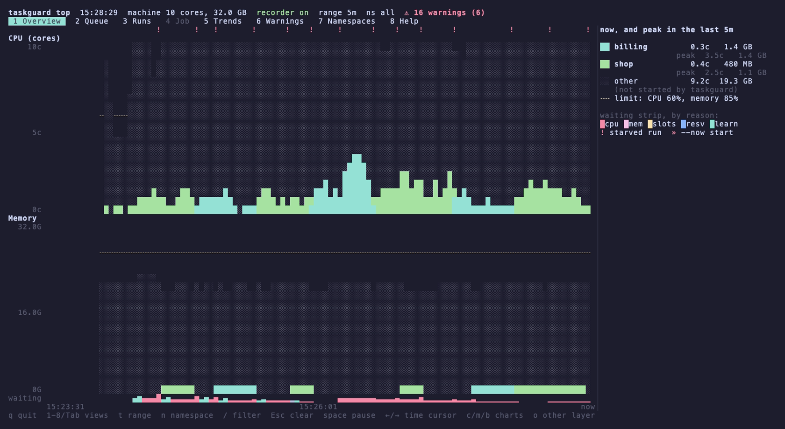
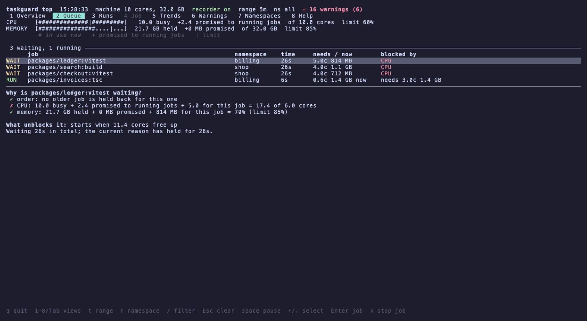
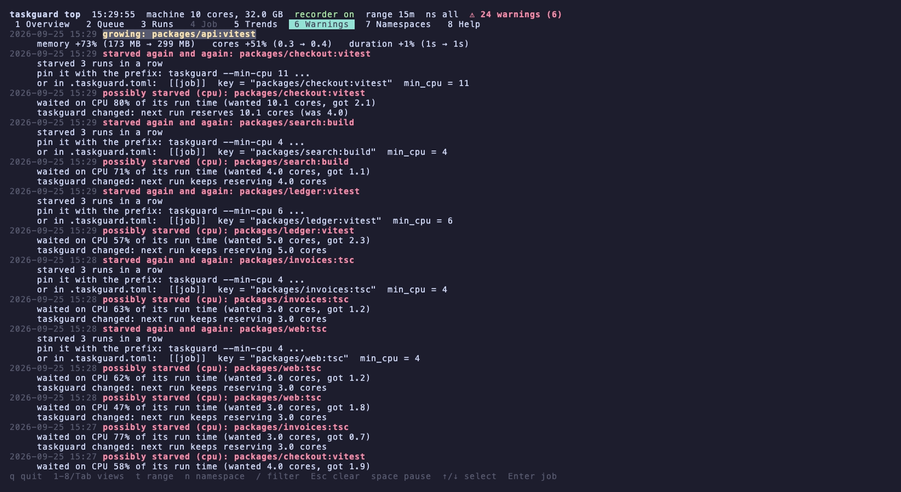
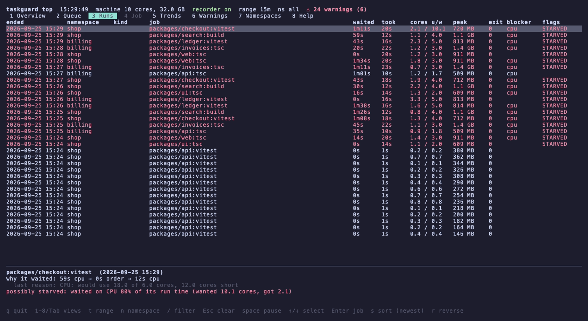
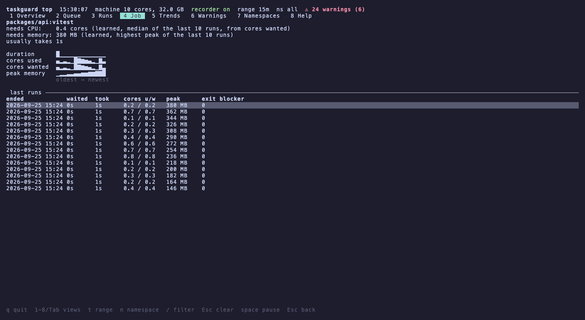
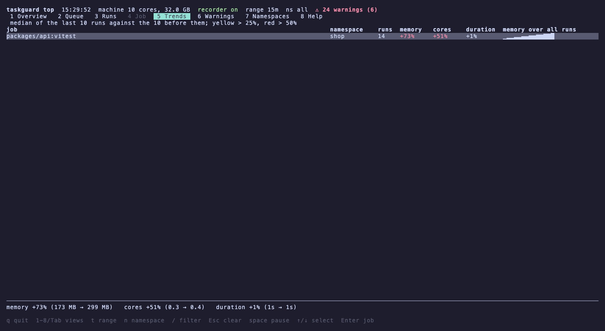
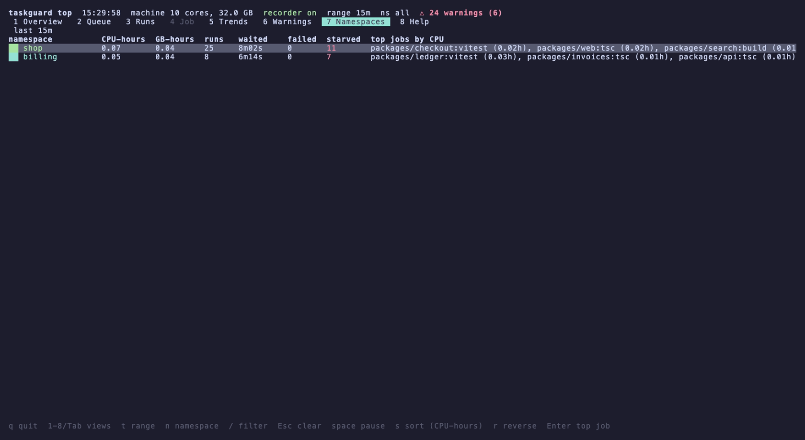
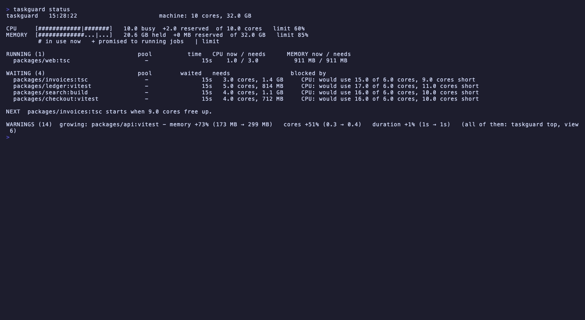

# taskguard

A `sem` that learns what each job needs.

Put `taskguard` in front of a command. The command starts only when the
machine has room for the CPU and memory that the same command used on its past
runs. Every call on the machine shares one queue, from any terminal, worktree,
task runner or agent.



The dashboard above shows a demo: two repos, `shop` and `billing`, share one
laptop. Coloured areas are the jobs that taskguard started, one colour per
repo. The grey area is everything else on the machine. The strip at the bottom
shows how many jobs waited, and why. To see it yourself, run
[the demo](#try-it-with-the-demo).

macOS and Linux. One binary, written in Rust.

## The problem

A task runner caps tasks inside one run only. Two terminals, two worktrees, an
editor and a coding agent can each start a full set of compiles and test
suites. Nothing on the machine holds a shared ceiling, so a large monorepo
pushes the machine into swap, and the operating system starts to kill
processes.

A fixed limit does not fix this. `turbo --concurrency=2` still lets two jobs
that each want 20 GB run side by side, and it holds back twenty small jobs that
would fit easily. GNU `sem` has the same gap: it counts slots, and a 25 GB
compile and a 50 MB lint each take one slot.

`taskguard` counts what the jobs really use.

## How it decides

A job starts when both of these fit:

```
CPU busy     + CPU still promised to running jobs     + this job's CPU need     <= cpu_max  (100% of cores)
memory held  + memory still promised to running jobs  + this job's memory need  <= mem_max  (85% of RAM)
```

A job that misses by only a little, or only because of programs outside
taskguard, starts anyway with a warning (see "A little short is close enough"
below).

- **Needs are learned.** Each run is measured, and the result is kept per
  command. The memory need is the highest peak of the last 10 runs, because
  running out of memory kills processes. The CPU need is the cores the job
  *used* in its last 10 runs, because too little CPU only makes a job slower.
  It is a median in which a run counts half as much as one four runs newer, so
  it follows a job that gets faster or slower. Time a job's threads spent
  waiting for a core does not count: `tsgo` and `oxlint` start one thread per
  core, so on a busy machine they wait on every core. Runs far above the
  others count as outliers do for memory (below). A run that was starved of
  CPU used less than it needs, so starved runs are left out while three runs
  that were not starved remain; what a starved run waited for never raises
  the need. A memory need never passes `mem_max`: a job that once took more
  is capped there, and says so.
- **One wild run does not set the need.** A peak more than `outlier_ratio`
  (2) times the next peak below it, and at least `outlier_min` (1 GB) above
  it, is an outlier: a CI run that took 12 GB where it usually takes 4.5 GB.
  The first time it does not count, the second time it counts half, the third
  time in full (`outlier_weights`). A run that failed never counts: a run that
  goes wrong can take far more than the job needs, and on a real machine most
  outliers were such runs. Jobs whose usual peak is under `outlier_min` have
  no outliers: there a jump is mostly a full build after cache hits, and
  holding it back would start the next full build into a full machine. The
  job's line says when its run was an outlier, `taskguard outliers` lists
  them, and `taskguard prune` drops runs from the history.
- **A first run reserves a cautious guess.** A job with no history counts as
  needing what jobs like it needed in the last 30 days: the 90th percentile of
  their memory peaks and the 75th of the cores they wanted. "Like it" means the
  same command of the same package first (its `package.json` name), so a
  package that moved to another folder starts from what it used before; its
  history itself stays with the old folder. Then the same kind and pool (a
  `ci` run in DALP's `throttle-suite`), then the same kind, then the same
  pool, then the same program; 1.5 GB without any (`new_job_mem`). A shell
  job gets the kind of the heaviest command it runs: `sh -c "git fetch && bun
  install && bun run ci:local"` is a `ci` run.
- **First runs start in groups, and a group must settle.** At most a group of
  first runs may still grow at once: one job per free core, and only as many
  as fit in the free memory at their guess. A first run has settled when its
  memory has not risen by 10% for 20 seconds, or when it has run for 2
  minutes; then the next one may start. At most a group of first runs starts
  per `learn_stagger` seconds. A first run that similar jobs finish within 5
  seconds (`cpu_min_duration`), such as a lint, is over before it could grow:
  it neither waits nor counts. Memory is checked for every job. With an empty
  history, DALP's full `ci` graph took 372 s this way, against 671 s when
  first runs went one at a time.
- **A running job's needs follow its peak.** When a job passes its needs, its
  memory need becomes its peak plus 25% and its CPU need what it wants, so what
  it still promises to take keeps up with what it takes. The Queue shows in red
  how far jobs are above the needs they started with.
- **Memory pressure stops everything new.** When the kernel reports memory
  pressure (macOS: warning or critical; Linux: PSI above 20%), nothing new
  starts until it eases, whatever the estimates say.
- **Memory is read at its recent peak.** Admission uses the highest reading
  of the last 10 seconds, so a job never starts in a short dip.
- **Short jobs skip the CPU reading, not the CPU budget.** A job that usually
  ends within 5 seconds is over before the CPU reading could react to it, so
  the reading does not hold it back. It still waits while the cores that
  running jobs were promised, with its own, would pass `cpu_max`. Without this,
  a task runner with a high concurrency starts every short job at once and
  fills every core. Memory is checked for every job.
- **"Promised" is the growth still to come.** A compile that sits at 2 GB
  but peaked at 20 GB last time still has 18 GB to take. Without this, a second
  job is started into space the first one is about to use.
- **The machine readings count everything.** Your browser and your editor
  count too, not only jobs that taskguard started.
- **A little short is close enough.** A job short of memory by at most
  `noise_mem` (2%) of RAM, or of CPU by at most `noise_cpu` (0.5) cores,
  starts anyway: readings move by that much from one second to the next.
  So does a job that only programs outside taskguard keep out, while
  taskguard's own jobs fit under the limits (`outside_admit`). Memory stays a
  hard rule at `pause_at` (92%). Each such start prints a warning with what
  the job lacks and the rule that let it start.
- **Nothing running means the job starts,** whatever the CPU and memory
  readings say, so the queue cannot deadlock on a wrong reading. Memory
  pressure is the one exception: then the load comes from other programs, and
  jobs wait until it eases.
- **Any order, oldest first.** A small job may pass a big one that does not
  fit yet. This is safe: a job only reaches taskguard when its launcher has
  decided that it may run. Turbo starts a task only after the tasks it depends
  on are done, and `a && b` starts `b` only after `a` ends.
- **One run at a time.** A job started by a task runner (`turbo`, `nx`,
  `make`, `moon`, `lage`, `just`) belongs to that runner's run. When several
  runs wait, a job of the run that queued first goes first, as long as it can
  start. Twenty pipelines that each move a little all finish late; twenty in
  turn finish one after the other, and the last one no later. A job of the
  older run that does not fit holds nothing back, so no room is left idle.
  Priorities still come first. A waiting job with a higher priority holds the
  others back as a reserved job does: while it could start, and with backfill
  (below) not while it cannot use the room.
- **No starvation.** A job that newer jobs have passed for 2 minutes
  (`max_bypass`) gets a reservation. Nothing behind it in line starts until it
  has started, except by backfill (below).
- **Part of its CPU need is enough for a job that cannot fit.** A job whose
  CPU need is above the whole limit never fits, and a job that waited past
  `max_bypass` is the one others are held for. Such a job starts on part of
  its CPU need: at least `partial_fit` (0.5) of it must be free, and the
  machine must be near its lowest CPU use of the last two minutes (within one
  core, or a tenth of the cores), so it starts at a quiet moment and has the
  best chance to finish well. It then books the cores it got, not its whole
  need, so it does not hold every other job out while it runs; from there it
  follows what it uses. Memory stays a hard rule. `partial_fit = 0` turns it
  off; set it per machine in `~/.config/taskguard/config.toml`.
- **One line, no circles.** Every rule that holds a job back for another
  follows one fixed order: a higher priority, then the older run (a job outside
  any run counts from when it queued), then the older ticket. A job only ever
  waits for a job ahead of it, so jobs cannot wait for each other in a circle
  while the room they need sits free.
- **No waiting for a job that does not start.** A job ahead in line that may
  start does so within a tenth of a second. One that could start by these
  rules but still waits after 10 seconds has an owner that decides by other
  rules (an older taskguard, see Mixed versions) or not at all (stopped with
  Ctrl-Z). The job behind it marks it as stalled, says so with what the owner
  itself reports it waits for, and from then on no job waits for it. It may
  still start by itself. `taskguard status` shows the mark, and what an owner
  says when that differs from what it should do.
- **Backfill.** A reservation for a job that does not fit
  holds room it cannot use: a 29 GB compile that waits for memory keeps a
  0.2 GB install waiting too. So a reserved job holds
  its turn only while it could start: until it has waited `max_backfill`
  seconds, newer jobs that fit start while it cannot, and nothing newer starts
  once it fits. After `max_backfill`, a newer job that fits still starts if
  its learned duration says it ends before the reserved job could start
  anyway: before the running jobs have freed the room it lacks, or, when
  programs outside taskguard keep it out, before none of them runs (then the
  first in line starts whatever the readings say). Such a job takes no room
  the reserved one could use, so a steady stream of small jobs cannot keep it
  out, and a lint is not held up for half an hour behind a job that waits for
  two long test runs. A job with no learned duration waits. For a reserved job
  that may start on part of its need, "could start" means once that part is
  free. The drain always ends with the reserved job running: at the latest
  when no other job runs, also when its need is above the whole limit. On by
  default for 10 minutes (`max_backfill = 600`); `0` turns it off, `1800`
  lets every job that fits through for half an hour.
- **Pools** add a slot ceiling where jobs share something: one database, one
  set of services, one lock file. A slot ceiling only stops such jobs from
  running at the same time and breaking each other; CPU and memory are always
  shared by the whole machine. Pools count per worktree unless
  `per_checkout = false`, so other worktrees are never held up.
  `taskguard --id e2e -j1 ...`, a `[pool.NAME]` section, or the Config view
  of `taskguard top`.
- **Long-lived jobs** run until someone stops them, such as a dev stack. Mark
  them with `long_lived = true` in a `[pool.NAME]` or `[[job]]` section. Such
  a job starts when there is room for its start-up peak, and holds that peak
  for its start-up (`startup`, 300 seconds by default). Then its needs start
  again from what it uses: its CPU need is what it wanted over the last 10
  seconds, up or down, and its memory need what it holds plus 25%, or what
  its past runs grew to after their start-up when that is more, and it follows
  its peak from there. A DALP dev stack wants almost every core while it
  starts and seeds, then idles at a few percent; without this it kept every
  core for hours. Its history keeps both: the start-up peak, which the next
  run is admitted against, and what it took after. Past its start-up it
  counts as load from outside taskguard: no job waits for it to end, and when
  nothing else runs, the first in line starts whatever the readings say.
  `auto_pause` leaves it alone. `taskguard status` marks it `STEADY`.

### What is measured

| | macOS | Linux |
| --- | --- | --- |
| Job memory | physical footprint of the whole process tree | PSS of the whole process tree |
| Job CPU used | user + system time | `schedstat` run time |
| Job CPU wanted | used + time spent ready but waiting for a core (`ri_runnable_time`) | used + run-queue wait (`schedstat`) |
| Machine CPU | host tick counters | `/proc/stat` |
| Machine memory | the higher of active + wired + compressed, and the kernel's `memorystatus_level` | total - available |
| Memory pressure | `memorystatus_vm_pressure_level` | `/proc/pressure/memory` |

On macOS, active + wired + compressed falls exactly when the machine is in
trouble: under pressure the kernel moves pages to the inactive list and writes
compressed pages to swap. The kernel's own figure rises instead, so taskguard
takes the higher of the two.

Physical footprint is used on macOS because resident size hides compressed
pages. One measured `tsc` reported 3.8 GB resident while it really held 22 GB.
All readings are syscalls. They cost microseconds, not the 120 ms per process
of `/usr/bin/footprint`.

The whole process tree is measured, because the memory often lives in a
grandchild: a JavaScript entry point is a node process that starts the native
compiler.

## Install

What changed in each version: [`CHANGELOG.md`](CHANGELOG.md).

Prebuilt binaries for macOS (Apple silicon, Intel) and Linux (x86_64, ARM,
static) are on the [releases page](https://github.com/SpoBo/taskguard/releases):

```sh
# pick the target for your machine: aarch64-apple-darwin, x86_64-apple-darwin,
# x86_64-unknown-linux-musl or aarch64-unknown-linux-musl
target=aarch64-apple-darwin
curl -fsSL "https://github.com/SpoBo/taskguard/releases/latest/download/taskguard-$target.tar.gz" | tar -xz
install -m 755 "taskguard-$target/taskguard" ~/.local/bin/taskguard
```

Or build it from source:

```sh
git clone https://github.com/SpoBo/taskguard.git
cd taskguard
cargo install --path .
```

This puts `taskguard` in `~/.cargo/bin`. It needs Rust 1.89 or newer.

## Use

Put the prefix in the package scripts:

```json
{
  "scripts": {
    "typecheck": "taskguard tsc -p .",
    "test": "taskguard bun --bun vitest run",
    "build": "taskguard vite build"
  }
}
```

With turbo, prefix the package scripts, not the root `turbo run` command, and
give turbo a high `--concurrency`. Turbo then only sets the upper limit, and
taskguard decides what runs. A prefixed `turbo run` would hold one slot for the
whole run.

### Syntax

The shape follows GNU `sem`. There is one difference: taskguard runs in the
foreground by default, because turbo and npm need the command's exit code.

```
taskguard [options] [--] COMMAND [ARGS...]
taskguard --wait [--id NAME]
```

| Option | What it does |
| --- | --- |
| `-j N`, `+N`, `-N`, `N%` | Slot ceiling for this pool, as in sem. None by default. |
| `--id NAME` | Pool name (sem's semaphore id). |
| `--ns NAME` | Namespace for the dashboard. The default is the repo name, the same for every worktree. |
| `--st SECS` | `SECS > 0`: run anyway after SECS. `SECS < 0`: give up after -SECS, exit 124. |
| `--st-exit N` | The exit code when `--st` gives up, instead of 124. |
| `--key KEY` | History key. The default is the project path plus the command. |
| `--min-cpu N` | Never start with fewer than N free cores. |
| `--min-mem SIZE` | Never start with less than SIZE free (`6G`, `512M`). |
| `--priority N` | Higher starts first. The default is 0, or `priority` from the config. |
| `--now` | Skip the queue, but still measure and learn. |
| `--bg` | Wait for room, then return and let the job run on. |
| `--pipe` | With `--bg`: pass stdin to the command. |
| `-q` | Print only waits longer than the status interval. |
| `--hints`, `--no-hints` | Agent hints on or off for this call. |

The `--` is optional. Options stop at the first word that is not an option.
Use `taskguard run ...` for a command that has the same name as a subcommand.

`TASKGUARD_DISABLE=1` skips taskguard for one command. `enabled = false` in a
config file does the same for every command it applies to: all of them run
straight through, unqueued and unmeasured. A call nested inside a
running job starts at once and takes no second slot, even when a task runner in
between drops environment variables.

Long-running commands are never queued: watch modes, dev servers, `--version`
and `--help` run straight through (the list is in `src/builtin.rs`). Add your
own with `passthrough = ["storybook", "my-dev-server"]` in a config file; it
adds to the built-in list. See `taskguard doctor --explain "COMMAND"`.

### What a waiting job prints

Status lines go to stderr, so the command's own output stays clean:

```
[taskguard] queued packages/api:tsc - learned: 3.7 cores, 2.5 GB (5 runs)
[taskguard] waiting 15s web:build - blocked by CPU: would use 9.8 of 8.0 cores, 1.8 cores short. It starts when packages/api:tsc finishes; this is not a hang
[taskguard] start web:build - waited 19s; fits: CPU 2.7+1.3+4.4 of 8.0 cores, memory 63% of 85%
[taskguard] done web:build - 7s, used 4.4 cores sustained (wanted 4.8), 1.2 GB peak, exit 0 (0 still queued)
```

A job that CPU keeps out and that cannot fit now, because its need is above
the whole limit or it has waited past `max_bypass`, also prints advice:

```
[taskguard] advice web:typecheck needs 30.0 cores; the limit is 27.0 cores (cpu_max 150% of 18 cores), so it never fully fits
[taskguard] advice the room is held by web:lint 15.0 cores, about 4m00s left; web:lint-css 15.0 cores, about 6m10s left
[taskguard] advice it has waited 1m00s; 46 jobs wait behind it
[taskguard] advice it starts by itself on 15.0 cores (partial_fit 50% of its need) once that much is free and the machine is near its recent low
[taskguard] advice to start it now anyway: taskguard start 4242. It then runs on the cores it gets, slower, and no check holds it back, memory included
[taskguard] advice to change the outcome: raise cpu_max, lower partial_fit, or if its need comes from old runs, check taskguard history and run taskguard prune 'web:typecheck' --apply
```

It prints once when it applies and again with each status line, with hints
off too: an agent only sees this output, and this is how it learns to get the
job going.

**Agent hints** ("this is not a hang", "starts when X finishes") are on by
default, so an LLM agent does not kill a command that only waits. Set
`hints = false` per repository or directory. `--hints` and `--no-hints` override
it for one call.

**For agents:** `taskguard help --all` prints every command with all its
options in one text. Point an agent at it, or put its output in the agent's
instructions, so it knows the whole tool at once. `taskguard help COMMAND`, or
`COMMAND --help`, shows one command.

### Starved runs

taskguard also measures whether a job was held back while it ran: its threads
waited for a core more than half as long as they ran, it paged memory in while the machine was under memory pressure, or it
took 1.5 times its usual time while the machine was full. A run starved of
memory teaches a higher need for the next run; a run starved of CPU does not
raise the CPU need (see "Needs are learned"). With hints on it prints advice
that can be pasted:

```
[taskguard] warning packages/api:vitest_run - possibly starved: waited on CPU 64% of its run time (wanted 6.1 cores, got 2.2)
[taskguard] advice already done: the next run reserves 6.1 cores (was 3.0)
[taskguard] advice to pin it: script "test" in packages/api/package.json -> "taskguard --min-cpu 7 bun --bun vitest run"
[taskguard] advice or let vitest fit the room it gets: add --maxWorkers=2
```

The advice names the exact script and file, because package managers tell each
script its name and package.json path. It knows the parallelism flags of
vitest, jest, playwright and turbo, and the node heap flag.

## The dashboard

`taskguard top` is a terminal dashboard in the style of btop.

**Queue.** What runs and what waits. The Why panel checks every rule for
the selected job, with numbers, and says what will unblock it.



**Warnings.** Runs that were starved, what taskguard changed for the next
run, and the minimum to pin when a job starves again and again.



<details>
<summary>More views: runs, job, trends, namespaces, and the <code>status</code> command</summary>











</details>

| View | What it shows |
| --- | --- |
| 1 Overview | Machine CPU and memory over time. The load of jobs taskguard started is stacked in colour per namespace. The load it did not start is split into groups: agents (with everything they started), browsers, editors, dev services such as databases, containers, and chat and other apps. The legend names the biggest programs in each group, so you can see what to close to make room. A strip shows how many jobs waited, coloured by reason, and `!` marks a starved run. |
| 2 Queue | Running jobs, then waiting ones. The bars show in red the load that running jobs have above their estimates. The Why panel checks every rule for the selected job, with numbers, and says what will unblock it and when. `g` starts a waiting job now, and `e` sets a job's needs for this run only (for example `2 4G`), so it can fit into room you know it will not outgrow. |
| 3 Runs | Past runs, sortable and filterable, with the reasons each one waited. |
| 4 Tasks | Every task taskguard knows, with its namespace, runs, last run, and what it learned. `n` (namespace), `/` (text) and `a` (not run for 1, 7, 30 or 90 days) filter the list. `x` prunes every run of the selected task; `X` prunes every task the filters leave, and needs a filter. Both ask first. Pruned runs move aside, as with `taskguard prune`, and `taskguard prune --undo --apply` puts them back. In a job's view, `x` prunes the selected run. |
| 5 Trends | Commands whose memory, CPU or duration grows: the last 10 runs against the 10 before. |
| 6 Warnings | Starved runs with the evidence, suggested minimums, trend alerts, and `--now` runs that went over a limit. |
| 7 Namespaces | CPU-hours, GB-hours, runs, waits and starved runs per namespace. |
| 8 Config | The limits, other settings and the slot ceiling of each pool. `←`/`→` change one. `Enter` on a pool lists its match patterns: `a` adds one, `d` removes one. `n` adds a new pool. The first change asks where to save it: your user config (every repo) or this worktree's `.taskguard.toml`; `w` switches later. Comments are kept. Jobs that already wait follow the change. |

`Enter` on a row opens that job: its learned needs and where each comes
from, sparklines over its runs, and what taskguard changed on its own. For a
run that is going on now, it also shows CPU and memory over the run and live
signs of starvation. `Esc` or `Backspace` goes back to the same row, and `j`
opens the last job again.

`?` lists every key of the view you are in, and the keys of every view; the
bottom line starts with it and shows the keys of the view that fit. `?` or
`Esc` closes the list, and any other key closes it and does its work.

Keys: `1`-`9`, `Tab`, or Shift, Option or Cmd with `←`/`→` change views. `t`
time range (5m to 7d), `n` namespace, `/` filter, `←`/`→` time cursor,
`c`/`m`/`b` charts, `o` hide the load taskguard did not start, `s`/`r` sort,
`q` quit. `PgUp`/`PgDn` jump most of a screen; the selected row keeps its
place on screen. Long lists say how many rows are hidden above and below.

On the Overview, `PgDn` moves the chart back in time and `PgUp` forward, by
80% of its width; the time cursor keeps its column. `l` (or `End`) goes back
to live. `Enter` at the time cursor picks one of the jobs that ran then: `↑`/`↓`
select a run, `Enter` opens it in the job view, `Esc` goes back to the chart.

The mouse
works on the tabs, the keys in the bottom line, and the rows; the wheel
scrolls lists and zooms the Overview.

A job started by hand or with other needs is still measured, so its next run
learns from what it really used. Jobs from taskguard before 0.1.3 cannot be
started or changed from the dashboard.

`taskguard top --print [--view NAME] [--range 1h] [--keys]` prints one frame as plain
text, for scripts and agents.

The history comes from a small recorder process. The first job starts it, it
samples the machine and the groups of other programs every 2 seconds, and it
exits by itself 30 minutes after the last job. Nothing is installed as a
service. On Linux it reads the PSS of another program in full every two
minutes, and sooner when its resident size moves by more than a quarter; in
between it moves the last reading by the change in resident size. The kernel
walks every page of a process to add up PSS, so reading it for every process
every 2 seconds took about half a core on a machine with 1,700 processes.

## Try it with the demo

`scripts/demo.sh` fills a scratch state with about four minutes of made-up
monorepo work, in two repos. The jobs are busy loops and a Python process that
holds memory, so taskguard really measures, learns and queues them. The demo
sets a low CPU limit (60%), so jobs have to wait.

```sh
scripts/demo.sh                                        # terminal 1
TASKGUARD_DIR=/tmp/taskguard-demo/state taskguard top  # terminal 2
```

The demo keeps its state in `/tmp/taskguard-demo`. Your real queue and
history are not touched, so a plain `taskguard top` does not show the demo
jobs. Set `TASKGUARD=/path/to/taskguard` to try a local build.

## Commands

| Command | What it does |
| --- | --- |
| `taskguard [options] COMMAND` | Run a command when the machine has room for it |
| `taskguard --wait [--id NAME]` | Wait until no job of the pool runs or waits |
| `taskguard top` | The dashboard |
| `taskguard status [--json]` | What runs, what waits, and why |
| `taskguard pause JOB`, `taskguard resume JOB` | Pause or resume a running job by hand. JOB is a pid, a key, or a unique part of a key |
| `taskguard start JOB` | Start a waiting job now, whatever the limits say, as `g` in `taskguard top` does. JOB is a pid, a ticket, a key, or a unique part of a key |
| `taskguard history` | Learned needs per command |
| `taskguard outliers [PATTERN] [--ratio R] [--min SIZE]` | Memory peaks far above a job's other runs, and how much each counts. `--ratio 1.5` finds more, `3` fewer |
| `taskguard prune PATTERN [--older-than 30d]` | Drop the runs of the keys that match from the history. PATTERN is a key from `history`; `*` matches anything (`'packages/api:*'`). Without `--apply` it only shows what it would do |
| `taskguard prune --outliers [PATTERN] [--ratio R] [--min SIZE]` | Drop the outliers that `outliers` lists, with the same options |
| `taskguard prune --undo [PATTERN]` | Put pruned runs back |
| `taskguard doctor` | Configuration, live readings, and leftover tsc-queue shims |
| `taskguard doctor --explain "COMMAND"` | How one command is matched, pooled and learned |
| `taskguard import-history` | Load tsc-queue's memory history |
| `taskguard help COMMAND`, `taskguard COMMAND --help` | Help for one command: what it does, its options, examples |
| `taskguard help --all` | Every command in full, in one text, for LLM agents |

`--help` after the command you run belongs to that command:
`taskguard -- tsc --help` shows tsc's help.

## Configuration

Settings come from files, in layers. Later layers win:

1. built-in defaults
2. `~/.config/taskguard/config.toml`
3. `[dir."<path>"]` sections in that file, for jobs inside that path
4. `.taskguard.toml` in the repository
5. command-line flags

Files are used, not environment variables, because turbo's default strict env
mode drops variables it does not know.

[`taskguard.example.toml`](taskguard.example.toml) lists every setting. The
most used ones:

```toml
cpu_max = 100          # percent of all cores
mem_max = 85           # percent of RAM
hints = true           # agent hints on status lines
outlier_ratio = 2      # a peak this many times the next one is an outlier; 0 = off
outside_admit = true   # start jobs that only other programs keep out
partial_fit = 0.5      # a job that cannot fit starts on half its CPU need; 0 = off
max_backfill = 600     # small jobs pass a stuck job this long, then the machine drains

[pool.e2e]             # a slot ceiling for one kind of job, per worktree
max_slots = 1

[pool.db]              # take away a built-in pool's ceiling
unlimited = true

[[job]]                # settings for one command
match = "vitest run --project integration"
min_cpu = 4
min_mem = "6G"

[pool.stack]           # dev stacks: four at a time, each holding its
max_slots = 4          # start-up peak for 10 minutes, then what it uses
long_lived = true
startup = 600
```

The built-in defaults name common JavaScript tools, not the scripts of one
repo. Put a repo's own scripts in its `.taskguard.toml`:

- single-slot pools per checkout for database migrations (`drizzle-kit`,
  `prisma`, `knex`, `sequelize`, `typeorm`), e2e runs (`playwright test`,
  `cypress run`) and integration runs (`vitest --project integration`)
- launchers such as `bun --bun`, `bunx`, `npx`, `pnpm exec`, `devenv shell --`
  and `node` are stripped before matching
- watch modes and dev servers run straight through

## Known limits

- By default taskguard only decides when a job starts. When another program
  suddenly takes a lot of memory after taskguard's jobs have started, the
  machine can still fill up; taskguard then starts nothing new until the
  pressure eases. With `auto_pause = true` it also pauses (SIGSTOP) its newest
  running jobs when memory reaches `pause_at`, and resumes them (SIGCONT) under
  `resume_at`. A paused job keeps its memory: the pause stops it from growing
  and lets the system compress it or move it to swap. It does not free it.
- A job can also be paused by hand: `taskguard pause JOB`, or `p` in the
  dashboard's Queue view. It stays paused until `taskguard resume JOB` or `p`
  again; auto_pause leaves it alone. New jobs may start while it is paused, and
  they may use its CPU. Its memory stays reserved. taskguard also sees a job
  that someone stopped with `kill -STOP` and treats it as paused by hand. It
  cannot see a Ctrl-Z in the terminal: that stops taskguard itself too.
- A job with no history reserves an estimate. A first run far bigger than
  similar jobs can still take more than its estimate before it is learned.
- An outlier that is real growth is learned late: the next run still
  reserves the usual peak, and only the third high run counts in full. A run
  that failed is never learned, even when it really needed that memory. Set
  `outlier_weights = [0.5]` to learn sooner, or `outlier_ratio = 0` to learn
  every peak at once.
- A job that starts early on `noise_mem` or `outside_admit` can push memory
  past `mem_max`, up to `pause_at`. Set `outside_admit = false` and
  `noise_mem = 0` to keep `mem_max` a hard rule.

## Moving from tsc-queue

This repository used to be `SpoBo/tsc-queue`, a bash tool that replaced the
compiler inside `node_modules` with a shim. GitHub redirects the old URL. taskguard needs no shims.

```sh
tsc-queue unload         # stop its launchd jobs first, or they re-wrap the compilers
tsc-queue uninstall      # put the original compilers back
cargo install --path .
taskguard import-history # its memory history becomes the first guess for tsc runs
```

Then add the prefix to the scripts. `taskguard doctor` reports shims that are
still installed.

## Files

Everything lives in `~/.cache/taskguard` (or `TASKGUARD_DIR`):

| Path | What it is |
| --- | --- |
| `wait/`, `run/` | One file per waiting or running job, named after its process |
| `stall/` | One file per stalled waiting job: who saw it, and what its owner said it waited for |
| `lock` | The queue lock; the kernel releases it when a process dies |
| `machine` | The shared machine reading |
| `taskguard.db` | Runs, samples and rollups (SQLite) |

A job that is killed leaves a file behind. The next process that looks sees
that its owner is gone and removes it, so a Ctrl-C never wedges the queue.

## Mixed versions

Different versions of taskguard can run on one machine at the same time. For
example, each worktree of a repo can pin its own version. They all share one
queue and one history in the state directory, so each version must read what
the others write:

- The queue entries and the `machine` file are JSON. Fields are only added,
  never removed, renamed or retyped, and a missing field gets a default.
- `taskguard prune` moves runs into the table `pruned_runs`, so every
  version stops learning from them; `prune --undo` moves them back. Without
  `--apply`, prune only shows what it would do.
- The database only gains tables and columns. A new column is nullable or has
  a default, so older versions can still insert rows.
- A job gets the same history key in every version.
- `TASKGUARD_HELD` keeps its meaning, so a nested call never takes a second
  slot, whatever version the outer call was.

A setting that a version does not know is ignored with a warning, not an
error: a repo can pin a newer taskguard that knows it, while an older one runs
from another worktree. `taskguard doctor` lists them. Versions before 0.2.1
stop with an error instead.

A version only follows the rules it knows. A version that does not know
`long_lived` runs such a job as any other: it holds its start-up peak until it
ends. Its waiting jobs do read the lower needs of a long-lived job that a newer
version runs, but they still wait for it to end when nothing else runs.
A version before 0.4.0 does not
know runs: its jobs never step aside for an older run. A version before
0.2.0 does not
read priorities: its waiting jobs start in ticket order and do not step aside
for a job with a higher priority. It does not know auto_pause either: its jobs
are never paused, and its waiting jobs may start while another job is paused.

Versions before 0.4.1 keep the line in ticket order; 0.4.1 and later order it
by the age of a job's run first. With nothing running, an old and a new owner
can each see the other as the job first in line and wait for it, and nothing
starts. In versions after 0.4.1 the waiting job behind such a pair marks the
one that does not start as stalled after 10 seconds and passes it. Two jobs of
0.4.1 or older can still wait for each other until a job of a newer version
queues or until one of them is stopped.

Tests hold each of these rules. A change that cannot follow them must use a
new state directory. Versions that use different directories do not see each
other's jobs. They still see the load of those jobs in the machine readings.

A version that does not know partial fit reads the `machine` file and leaves
the CPU history in it (`recent_cpu`) out when it writes the file. While its
recorder runs, newer versions see no recent low and start a partial fit as
soon as there is room for it. Such a version never starts its own job on part
of its need; a newer job behind it may then mark it as stalled (see above).
In 0.7.1 and older `max_backfill` is 0 by default, so such a version keeps
every reservation unless a settings file sets it.

Versions before 0.2.1 read settings files strictly: they reject a file with a
setting they do not know. The user config and a repo's `.taskguard.toml` are
read by every version that runs there, so set a new setting such as
`max_backfill` in them only once every such version is 0.2.1 or newer. The
dashboard's Config view does not offer `max_backfill` for that reason. It
writes `unlimited = true` only when you take a pool down to no limit; a
version that does not know `unlimited` keeps that pool's old ceiling.

## Uninstall

```sh
cargo uninstall taskguard
rm -rf ~/.cache/taskguard ~/.config/taskguard
```
